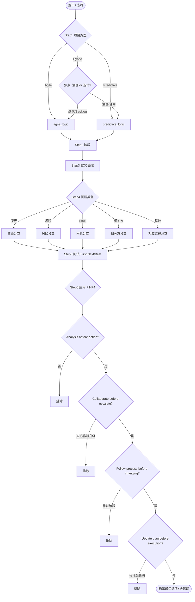

# Decision Tree（PMP 答题决策树）

> **用途**：Agent 分析情境题时的**主决策流程**。按 Step 1–6 顺序执行，不可跳步。每步输出判断结果与依据关键词。
>
> **关联文件**：`predictive_logic.md`（预测型分支）、`agile_logic.md`（敏捷分支）。

---

## 总览

```
输入：题干 + 选项
  │
  ▼ Step 1  项目类型 Predictive / Agile / Hybrid
  ▼ Step 2  项目阶段
  ▼ Step 3  ECO 领域
  ▼ Step 4  问题类型
  ▼ Step 5  题目要求（First / Next / Best …）
  ▼ Step 6  应用原则 → 选择最佳行动
  │
  ▼ 输出：推荐选项 + 排除理由 + 决策链
```

---

## Step 1：识别项目类型

### 判断规则

| 类型 | 决策条件 | 下一步 |
|------|----------|--------|
| **Agile** | Sprint、Backlog、PO/SM、迭代、增量 ≥2 强信号 | 加载 `agile_logic.md` |
| **Predictive** | WBS、基准、CCB、变更日志、阶段门 ≥2 强信号 | 加载 `predictive_logic.md` |
| **Hybrid** | 两类信号同时出现 | 拆题：本问焦点在「治理/合同」还是「迭代交付」 |
| **Unknown** | 信号不足 | 标注【待确认】；用通用原则 P1–P2 保守推理 |

### 关键词速扫

```
Agile:     Sprint, iteration, backlog, PO, SM, daily scrum, increment, user story
Predictive: baseline, CCB, WBS, Gantt, charter, change request, phase gate, EVM
Hybrid:    同时出现上述两组词，或「里程碑 + 两周发布」
```

**输出**：`project_type` + 命中关键词列表

---

## Step 2：识别项目阶段

### 判断规则

| 阶段 | 信号词 / 情境 |
|------|---------------|
| **Initiating** | 章程、商业论证、识别相关方、任命 PM、可行性 |
| **Planning** | 定义范围、WBS、进度网络、预算、风险识别、质量计划、采购计划 |
| **Executing** | 指导团队、建设团队、实施采购、分发信息、执行应对 |
| **Monitoring and Controlling** | 偏差、变更请求、绩效测量、控制范围/进度/成本、监督风险 |
| **Closing** | 收尾、最终报告、经验教训登记、合同关闭、释放资源 |

### 阶段 × 类型注意

| 情境 | 提示 |
|------|------|
| Agile + 「规划」 | 可能是 Sprint Planning（迭代内），非整体 Planning 阶段 |
| 变更/偏差/绩效 | 多为 Monitoring and Controlling |
| 经验教训 | 全阶段收集；Closing 强调归档 |

**输出**：`project_phase`（主阶段 + 可选次要阶段）

---

## Step 3：识别 ECO 领域

### 判断规则

| ECO Domain | 触发主题 |
|------------|----------|
| **People** | 团队、冲突、激励、领导力、沟通、相关方、谈判、文化 |
| **Process** | 范围、进度、成本、质量、风险、采购、整合、变更、可交付成果 |
| **Business Environment** | 合规、治理、组织战略、价值交付、商业利益、法规、道德 |

### 快速分流

```
人际/沟通/冲突/相关方     → People
技术过程/工具/交付/变更   → Process
组织/合规/战略/商业价值   → Business Environment
```

**输出**：`eco_domain` + 关联知识领域（如风险管理、冲突管理）

---

## Step 4：识别问题类型

在 ECO 之下，归类**当前情境的核心矛盾**：

| 问题类型 | 识别信号 | 标准路径入口 |
|----------|----------|--------------|
| **变更** | 改范围/进度/成本、新需求、基准偏离 | 变更控制 / Backlog |
| **风险** | 可能发生的正面/负面不确定性 | 风险登记册 → 分析 → 应对 |
| **问题（Issue）** | 已发生的事件、缺陷、延误 | 问题日志 → 纠正 |
| **相关方** | 抵制、期望、冲突、沟通不畅 | 登记册 → 沟通 → 参与策略 |
| **质量** | 不符合标准、审计、缺陷、验收失败 | 控制质量 / 回顾 DoD |
| **资源/团队** | 技能不足、缺席、士气、虚拟团队 | 建设团队 / 资源管理 |
| **采购/合同** | 卖方、索赔、违约、RFP | 采购管理计划 + 合同 |
| **整合/优先级** | 多约束冲突、资源争用 | 整合权衡、沟通升级 |

**Risk vs Issue 硬规则**：

- 未发生 → Risk
- 已发生 → Issue（即使题干仍写「风险」）

**输出**：`problem_type` + 推荐过程链第一步

---

## Step 5：判断题目要求

### 问法识别

| 问法 | 英文信号 | 决策含义 |
|------|----------|----------|
| **First** | first, initially, should do first, at the beginning | 当前情境下**最先**执行的**一步** |
| **Next** | next, then, following, after … what should | 紧接上文动作的**下一步** |
| **Best** | best, most effective, greatest benefit | **综合最优**，可含多步中的战略选择 |
| **Most Appropriate** | most appropriate, most likely | **情境最贴合**，排除过度/不足反应 |
| **Should Do** | should, recommended, appropriate action | 规范或流程要求的应有行为 |
| **LEAST / NOT / EXCEPT** | 否定词 | 选**最不该**做的或**例外**项 |

### First / Next / Best 判断规则

```
┌─────────────────────────────────────────────────────────┐
│ FIRST  = 流程起点 / 分析起点 / 登记起点                    │
│          ✗ 不选最终解决方案、长期最优、收尾动作           │
├─────────────────────────────────────────────────────────┤
│ NEXT   = 题干或隐含「已完成动作」之后的紧接一步            │
│          → 先还原状态机当前节点，再 +1                    │
├─────────────────────────────────────────────────────────┤
│ BEST   = 在合理步骤完整的前提下选综合最优                  │
│          可包含沟通+分析+流程，但须符合项目类型             │
├─────────────────────────────────────────────────────────┤
│ Most Appropriate = 情境适配 > 理论完美                   │
│          排除：过度反应、反应不足、越权、违反流程           │
└─────────────────────────────────────────────────────────┘
```

### First vs Best 对照（高频）

| 情境 | First | Best |
|------|-------|------|
| 新变更请求 | 记录并评估影响 | 完整变更流程 + 沟通 |
| 新风险 | 更新风险登记册 | 分析 + 规划应对 + 监督 |
| 团队冲突 | 面对面了解/合作解决 | 可能相同，但 Best 可含跟进策略 |
| 相关方不满 | 沟通了解诉求 | 管理期望 + 参与计划调整 |
| Sprint 中新增需求 | 与 PO 协商进 Backlog | 保护 Sprint + 透明优先级 |

**输出**：`question_intent` + 对选项的筛选规则（如「排除执行类」「排除上报类」）

---

## Step 6：选择最佳行动

### 全局原则（按优先级，高覆盖低）

```
┌── P1  Analysis before action ─────────────────────────┐
│     先：收集信息、查登记册/计划、评估影响、根因分析      │
│     后：执行、拒绝、上报、改基准                         │
├── P2  Collaborate before escalate ────────────────────┤
│     先：团队、PO、相关方、卖方面对面沟通协商             │
│     后：发起人、管理层、CCB（在职责需要时）              │
├── P3  Follow process before changing ────────────────┤
│     先：变更流程 / 风险流程 / Backlog / 合同流程         │
│     后：直接改范围、改基准、改 Sprint 承诺               │
├── P4  Update plan before execution ──────────────────┤
│     先：批准并更新计划、基准、Backlog、项目文件          │
│     后：指导执行、发布、交付                             │
└──────────────────────────────────────────────────────┘
```

### Step 6 执行算法

```
1. 根据 Step 1 加载 predictive_logic 或 agile_logic 分支规则
2. 根据 Step 4 problem_type 取「标准处理顺序」清单
3. 根据 Step 5 question_intent 取清单中对应位置的动作：
      First  → 清单[0] 或「分析/记录」类
      Next   → 清单[current_step + 1]
      Best   → 完整路径中最优项（常含 P1+P2+流程）
4. 用 P1–P4 过滤选项：
      - 未分析即行动     → 排除
      - 未协作即升级     → 排除（除非题干已写明协作失败）
      - 未批即改基准     → 排除
      - 未更新计划即执行 → 排除
5. 剩余选项中，选与 project_type + phase + eco_domain 最一致者
6. 对每项干扰选项标注触犯的陷阱类型
```

### 分支决策简表

| Step 1 类型 | Step 4 变更 | Step 6 首选动作 |
|-------------|-------------|-----------------|
| Predictive | 变更 | 记录 CR → 评估 → CCB |
| Agile | 变更 | PO → Backlog → 协商 Sprint 影响 |
| Predictive | 风险 | 登记册 → 分析 → 应对规划 |
| Agile | 风险 | 透明讨论 → Backlog 排序/ Spike |
| 任意 | 相关方 | 查登记册 → 沟通 → 调整参与 |
| 任意 | Issue | 问题日志 → 纠正 → 跟踪 |

---

## 完整决策树（Mermaid）



---

## Agent 输出模板

每道题分析必须显式写出决策链：

```markdown
**决策链**
Step 1 项目类型：Predictive — 关键词 [CCB, baseline]
Step 2 阶段：Monitoring and Controlling
Step 3 ECO：Process（整合/变更）
Step 4 问题类型：变更
Step 5 问法：First
Step 6 原则：P1 分析 → 记录变更请求并评估影响（非立即执行）
→ **推荐：B**
```

---

## 全局排除清单（选项一票否决）

| 情形 | 排除 |
|------|------|
| 违反 P1 | 未了解情况就执行/拒绝/上报 |
| 违反 P2 | 第一步找高管/发起人（无协作前提） |
| 违反 P3 | 直接改基准 / Sprint 内静默加范围 |
| 违反 P4 | 计划未批先干活 |
| 角色越权 | SM 定优先级、PM 改章程、团队绕过 PO |
| Risk/Issue 混淆 | 已发生当风险管 |
| First 题选 Best | 选收尾/最优而非第一步 |
| 极端措辞 | always, never, immediately, all, without |

---

## 与其他模块衔接

| 模块 | 衔接点 |
|------|--------|
| `question_analysis` 工作流 | §3 PMP Analysis Framework 与本决策树 Step 1–6 一一对应 |
| `predictive_logic.md` | Step 1 = Predictive 时的 Step 4–6 细节 |
| `agile_logic.md` | Step 1 = Agile 时的 Step 4–6 细节 |
| `mistake_schema` | `wrong_type` 可与 Step 6 排除理由（陷阱类型）映射 |
